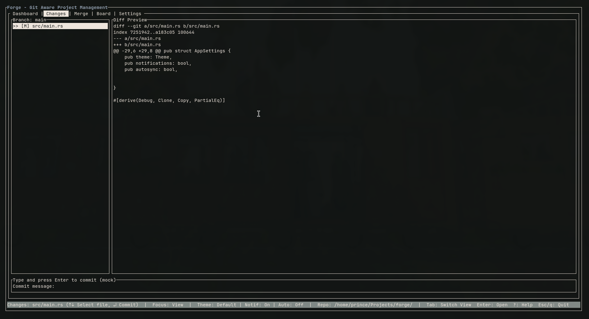

# Forge

**A developer-first, terminal-based Git-aware project management system.**

Current release: v0.3.1

Manage Git repositories, view diffs, track tasks, and collaborate—all from your terminal without leaving your coding flow.



## Quick Start

```bash
cargo build --release
./target/release/forge
```

## Key Features

- 🔀 **Git Integration** — Real-time file status and diff preview
- 🌐 **Remote Operations** — Fetch, pull, and push with progress + cancellation
- 📋 **Project Board** — Kanban task tracking (Pending → Current → Completed)
- 🔗 **Branch Management** — Create, switch, and delete branches
- 📝 **Commit History** — Browse and inspect commits
- 👥 **Team Management** — Track modules and developers
- 🔀 **Merge Visualization** — Side-by-side local/incoming previews with accept markers
- ⚙️ **Customizable** — Theme switching, notifications, and autosync
- ⌨️ **Keyboard-Driven** — Fully navigable without mouse

## Documentation

📚 **[Complete Documentation →](https://github.com/Princelad/forge/wiki)**

- **[Getting Started](https://github.com/Princelad/forge/wiki/Getting-Started)** — Installation and first run
- **[Features](https://github.com/Princelad/forge/wiki/Features)** — Complete feature overview
- **[Keyboard Shortcuts](https://github.com/Princelad/forge/wiki/Keyboard-Shortcuts)** — All keybindings
- **[Architecture](https://github.com/Princelad/forge/wiki/Architecture)** — System design
- **[Development](https://github.com/Princelad/forge/wiki/Development)** — Contributing guide
- **[API Reference](https://github.com/Princelad/forge/wiki/API-Reference)** — Core types and functions
- **[Workflows](https://github.com/Princelad/forge/wiki/Workflows)** — User workflows and interaction patterns
- **[Performance](https://github.com/Princelad/forge/wiki/Performance)** — Benchmarks and optimization
- **[Roadmap](https://github.com/Princelad/forge/wiki/Roadmap)** — Future plans
- **[FAQ](https://github.com/Princelad/forge/wiki/FAQ)** — Common questions

## Requirements

- **Rust 1.70+** ([install here](https://rustup.rs/))
- **Git 2.0+**
- **Terminal** with 256-color support

## Build & Run

```bash
# Clone the repository
git clone https://github.com/Princelad/forge.git
cd forge

# Build for production
cargo build --release

# Run in a Git repository
cd /path/to/your/repo
/path/to/forge/target/release/forge
```

## Usage

1. **Navigate** with Tab and Arrow keys
2. **Stage files** with Space
3. **Commit** with Enter
4. **View help** with `?`
5. **Fetch** with Alt+F (Changes view)
6. **Push** with Alt+P (Changes view)
7. **Pull** with Ctrl+L (Changes view)
8. **Quit** with Ctrl+C

See the **[Keyboard Shortcuts](https://github.com/Princelad/forge/wiki/Keyboard-Shortcuts)** page for complete reference.

## Contributing

Contributions are welcome! See **[CONTRIBUTING.md](CONTRIBUTING.md)** for quick start, or the **[Development](https://github.com/Princelad/forge/wiki/Development)** wiki for comprehensive guidelines.

## License

GPL-3.0-only

---

**Need help?** Check the **[FAQ](https://github.com/Princelad/forge/wiki/FAQ)** or open an issue on GitHub.
